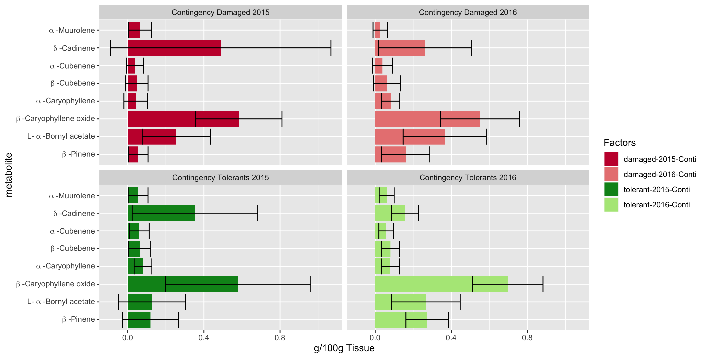

# README Paper Abies vs ozone

## Pre-requirements

Before starting the analysis here are the programs that need to be installed:

## SOFTWARE

* [R](https://cran.r-project.org)
* [Rstudio (optional)](https://rstudio.com)

## R packages

* **ggplot2**
* **reshape2**
* **ggfortify**
* **corrplot**


## METABOLOMICS directory structure:

```
+---- Abies_religiosa_vs_ozone/
|	+--2_METABOLOMICS/
|          +--bin/
|               +--Rstudio/
|                 +--1.1.-Make_df_allsamples_metabol.R
|                 +--2.1.-Calculate_relative_abs.R
|                 +--3.1.-ANOVA.R
|                 +--4.1.-Barplots
|                 +--5.1.-PCA.R
|                 +--Load_html_files.R
|          +--data/
|              +--GC-MS/
|                 +--LibSrch_3.htm
|                 +--LibSrch_5.htm
|          +--metadata/
|              +--Tablas_datos/
|                 +--Metabolites_GC-MS_ALL.xls
|                 +--Metabolites_GC-MS_orderbyCAS.xls
|                 +--Metabolitos_con_menor_presencia.xls
|                 +--Metabolitos_mayor_presencia_1.xls
|                 +--Metabolitos-Tesis-Vero.csv
|                 +--Metabolitos-Tesis-Vero.xls
|                 +--Metabolitos-Tesis-Vero.xlsx
|              +--htm_df.txt
|              +--exp_table.txt
|              +--exp_table.csv
|              +--calculate_relative_abs.txt
|          +--outputs/
|              +--4.1_barplot_images_conti.png
|              +--4.1_barplot_images_SS.png
|              +--5.1_PCA_conti_HvsD.png
|              +--5.1_PCA_moderated_HvsD.png
|          +--README.md
```

## Content (2_Metabolomics)

**`/bin`**

Here you will find the scripts that are needed to perform the analyses. There is a folder for scripts that run in [Rstudio](https://github.com/VeroIarrachtai/Abies_religiosa_vs_ozone/tree/master/2.-METABOLOMICS/bin/Rstudio).

**`/data`**

Here are the product files of the Gas chromatography–mass spectrometry (GC-MS).

**`/metadata`**

Here are tables and data that complement the omics data. Such as name of samples, name of genes, name of sequences.

**`/outputs`**

The figures from Rstudio are stored here.

**`/README.md`**

This is a README that describes the steps to perform the data analysis. It is organized numerically. It is explained that input is necessary and what outputs are obtained from each step.


# 1.- Load data by GC-MS

The data can be processed manually as shown in ANNEX 1 of this section or can be uploaded to an R table as explained below.

The .htm files were loaded into a table that included the data:

* Id (sample)
* pk (peak)
* RT (retention time)
* Area% (percentage of area)
* Ref
* CAS # (CAS number)
* Qual (value)

```
**OUTPUT**:
  * FUNCTION:Load_html_files.R**(Load_html_files.R)
```

## 1.1.-Make data frame with all metabolites samples

SCRIPT in 2_Metabolomics/Rstudio/[1_1_Make_df_allsamples_metabol.R](bin/Rstudio/1_1_Make_df_allsamples_metabol.R)

```
**INPUT**:
  * FUNCTION:Load_html_files.R**(Load_html_files.R)
  * Files.htm:(LibSrch_3.htm, LibSrch_4.htm, etc.)

**OUTPUT**:
  * htm_df.txt:(htm_df_allsamples.txt)
```

## 1.2.-Select metabolites


```
**INPUT**:
  * htm_df.txt:(htm_df_allsamples.txt)

**OUTPUT**:
  * htm_df.txt:(htm_df_allsamples.txt)
```


# 2.- Calculate relative concentration

The following script was used to calculate the relative concentration of metabolites.

* **INPUT**:
  * **metabolitos.csv/htm_df.txt**(metabolitos_Tesis_Vero.csv)

* **OUTPUT**:
  * **calculate_relative_abs.txt**(calculate_relative_abs.txt)

## 2.1.-Calculate_relative_abs

SCRIPT in 2_METABOLOMICS/Rstudio/[2_1_Calculate_relative_abs.R](bin/Rstudio/2_1_Calculate_relative_abs.R)

**INPUT**:**metabolitos.csv/htm_df.txt**(metabolitos_Tesis_Vero.csv)

**OUTPUT: calculate_relative_abs.txt**

# 3.-Make ANOVA

Do ANOVA analysis to compare effect between season, condition and year of exposure

* **INPUT**:
  * **calculate_relative_abs.txt**(calculate_relative_abs.txt)

* **OUTPUT**:
  * **ANOVA_tables**


# 3.1.-Make ANOVA

SCRIPT in 2_METABOLOMICS/Rstudio/[3_1_ANOVA.R](bin/Rstudio/3_1_ANOVA.R)

* **OUTPUT: ANOVA_tables.png**


# 4.-Make barplots

Compare metabolites between season, condition and year of exposure

* **INPUT**:
  * **calculate_relative_abs.txt**(calculate_relative_abs.txt)

* **OUTPUT**:
  * **barplot_images.png**(barplot_images_SS.png, barplot_images_conti.png)


# 4.1.-Make barplots

SCRIPT in 2_METABOLOMICS/Rstudio/[4_1_Barplots](bin/Rstudio/4_1_Barplots.R)

**OUT: barplot_images.png**




# 5.-Make PCA

Compare metabolites between season, condition and year of exposure

* **INPUT**:
  * **calculate_relative_abs.txt**(calculate_relative_abs.txt)

* **OUTPUT**:
  * **"exp_table.csv"**("exp_table.csv")
  * **"exp_table.txt"**("exp_table.txt")


# 5.1.-Make PCA

SCRIPT in 2_METABOLOMICS/Rstudio/[5_1_PCA](bin/Rstudio/5_1_PCA.R)

**OUT: exp_table.csv, exp_table.txt, PCA_images.png****


# ANEXX 1

GC-MS data were obtained in lists for each sample.


Each pk (peak), RT (retention time), Area% (percentage of area) CAS # (CAS number) and Qual (value) of all samples is recorded in an excel table.

```
 	Tablas_datos/Metabolites_GC-MS_ALL.xls
```


Subsequently, each metabolite present in the samples was ordered according to CAS #. The first CAS option was taken to order the metabolites.


```
 	Tablas_datos/Metabolitos_orderCAS.xlsx
```


Once organized by CAS, the CAS number was converted to the ID of each metabolite according to the NSI page and the name Library / ID given by the team

```
 	Tablas_datos/Metabolitos_GC-MS_orderbyCAS.xlsx
```


Two Tables were generated: One with the metabolites present in at least half of the samples / plus their related metabolites and another with minor presences.

```
Tablas_datos/Metabolitos con menor presencia.xlsxs
```
In the one with the greatest presence, several filters were made to discard metabolites with lower presences
```
Tablas_datos/Metabolitos_mayor_presencia_1.xlsx
```

Metabolites were maintained with Qual greater than 80 and metabolites were again discarded with lower precedence.
The final table is:
```
Tablas_datos/Metabolitos-Tesis-Vero.xlsx
```


###Contact

```
Verónica Reyes Galindo
veronica.rg.pb@gmail.com
```
