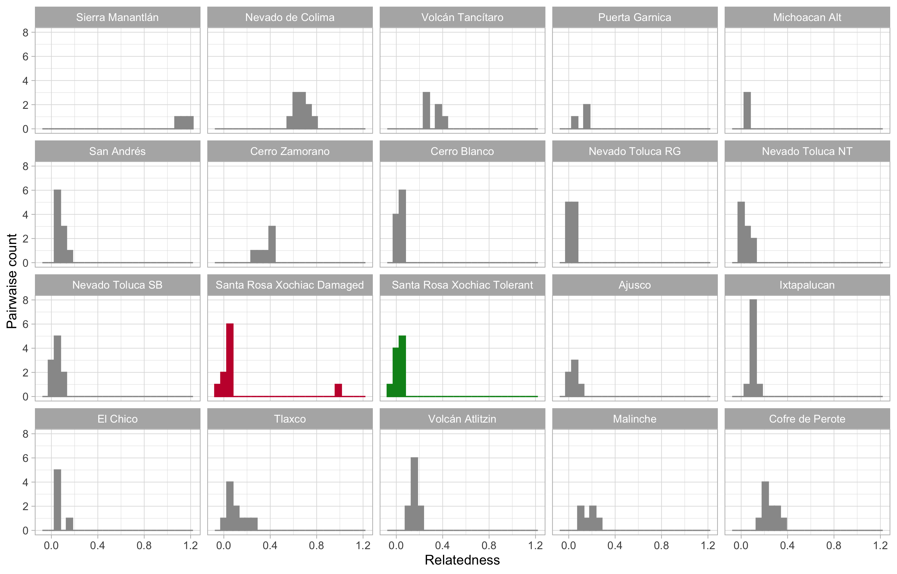

# README GENOMICS

## Pre-requirements

Before to  start the analysis, here are the programs that need to be installed:

## SOFTWARE

* [ipyrad](https://ipyrad.readthedocs.io/en/latest/)
* [admixture](http://software.genetics.ucla.edu/admixture/)
* [PLINK](https://www.cog-genomics.org/plink2/)
* [vcfTools](https://vcftools.github.io/man_latest.html)
* [R](https://cran.r-project.org)
* [Rstudio (optional)](https://rstudio.com)

## R packages

* **readr**
* **dplyr**
* **tidyr**
* **ggplot2**
* **geosphere**
* **gdsfmt**
* **SNPRelate**
* **MASS**
* **psych**
* **vegan**
* **permute**
* **lattice**
* **magrittr**
* **reshape**

## GENOMICS directory structure:

```
+--- Abies_vs_ozone/
|+--1_GENOMICS/
|   +--bin/
|	   	 +--R_scripts/
|	   	       +--3_3_Without_SNPs_in_same_loci.R
|	   	       +--4_2_Relatedness.R
|	   	       +--5_1_Mantel_test.R
|	   	       +--6_1_PCA.R
|	   	       +--7_3_Admixture.R
|	   	       +--8_2_Calculate_He.R
|	   	 +--shell_scripts
|	   	       +--1_1_Run_relaxed_assembly.sh
|	   	       +--2_3_Samples_missdata_maf.sh
|	   	       +--3_1_Calculate_frequences.sh
|	   	       +--3_2_ConvertFiles_vcf_to_plink.sh
|	   	       +--3_4_Extract_positions_HM.sh
|	   	       +--4_1_Calculate_relatedness.sh
|	   	       +--7_1_Calculate_CV_Admixture.sh
|	   	       +--8_1_Calculate_Heterozigozity.sh
|   +--data/
|	   	 +--relatedness/
|	   	       +--relsnp_snp_withoutDupLoci_88ind_maxmiss0.9_maf0.05.bed
|	   	       +--relsnp_snp_withoutDupLoci_88ind_maxmiss0.9_maf0.05.bim
|	   	       +--relsnp_snp_withoutDupLoci_88ind_maxmiss0.9_maf0.05.fam
|	   	       +--relsnp_snp_withoutDupLoci_88ind_maxmiss0.9_maf0.05.rel
|	   	       +--relsnp_snp_withoutDupLoci_88ind_maxmiss0.9_maf0.05.rel.id
|	   	 +--without_Dup_loci/
|	   	       +--snp_withoutDupLoci_88s_maxmiss0.9_maf0.05.bed
|	   	       +--snp_withoutDupLoci_88s_maxmiss0.9_maf0.05.bim
|	   	       +--snp_withoutDupLoci_88s_maxmiss0.9_maf0.05.fam
|	   	       +--snp_withoutDupLoci_88s_maxmiss0.9_maf0.05.vcf
|	   	       +--snp_withoutDupLoci_89s_maxmiss0.9_maf0.05.vcf
|	   	 +--88ind_maxmiss0.9_maf0.05.recode.vcf
|	   	 +--89ind_maxmiss0.9_maf0.05.recode.vcf
|	   	 +--samples_het_snp_withoutDupLoci_10ind_maxmiss0.9_maf0.05.het
|	   	 +--OSF.md
|   +--metadata/
|	   	 +--admixture_PQ_files/
|	   	       +--snp_withoutDupLoci_88s_maxmiss0.9_maf0.05.1.P
|	   	       +--snp_withoutDupLoci_88s_maxmiss0.9_maf0.05.1.Q
|	   	       +--logall_snp_withoutDupLoci_88s_maxmiss0.9_maf0.05.txt
|	   	 +--barcodes/
|	   	       +--Barcodes_1.txt
|	   	 +--fastqc_before_trimm/
|	   	       +--HI.4558.003.Sebastian1_R1_fastqc.html
|	   	 +--88_ind.txt
|	   	 +--Ar_IBD2.txt
|	   	 +--Ar_IBD_comparations.txt
|	   	 +--FST_VCFTools_Ar89.txt
|	   	 +--PLACA_FINAL_89_samples.csv
|	   	 +--positions_s88_Ar0.9.txt
|	   	 +--positions_s89_Ar0.9.txt
|	   	 +--samples_het_relat.txt
|   +--outputs/
|	   	 +--files_gds.gds
|	   	 +--4_2_Relatedness.png
|	   	 +--5_1_Mantel_test_NON_Linear.png
|	   	 +--5_1_Mantel_test_Linear.png
|	   	 +--6_1_PCA.png
|	   	 +--7_3_Admixture.png
|	   	 +--7_3_Admixture_2.png
|   +--README_genomics.md
```
## GENOMICS content

**`/bin`**
There are you will find the scripts that are needed to perform the analyses. There is a folder for scripts that run in [Rstudio](https://github.com/VeroIarrachtai/Abies_religiosa_vs_ozone/tree/master/1.-GENOMICS/bin/Rstudio) and another one for those that run in another program through the [terminal](https://github.com/VeroIarrachtai/Abies_vs_ozone/tree/master/1.-GENOMICS/bin/shell_scripts) and command line.

**`/data`**
There are the product files of the sequencing and analysis of them (plink and vcf files).

**`/metadata`** There are tables and data that complement the omics data. Such as name of samples, coordinates, name of genes, name of sequences.

**`/outputs`** There are outs product of the analysis of the data that do not serve as input for another analysis(.gds file). In the same way, the figures from Rstudio are stored here.

**`/README_genomics`** This is a README that describes the steps to perform the data analysis. It is organized numerically. It is explained that input is necessary and what outputs are obtained from each step.


# 1.0.-RUN de novo ASSEMBLY
Because my project is part of another great project, we had to do a lax assembly that would allow us to have the same coordinates for each SNP in the different species.

**So this step allows you to have a relaxed assembly ipyrad with two species**
You will need [ipyrad](https://ipyrad.readthedocs.io/en/latest/)

```
**INPUT**:
   * Archivos de la secuenciación **files.fq.gz**
   * barcodes **file.txt**

**OUTPUT**:
   * **file.vcf**(.vcf)
```

## 1.1.-Run relaxed assembly with ipyrad
SCRIPT in 1_GENOMICS/shell_scripts/[1_1_Run_relaxed_assembly.sh](bin/shell_scripts/1_1_Run_relaxed_assembly.sh)

```
ipyrad -p ../data/TMVB_5SNPrad.vcf -s 1234567 -f
```
**PARAMS FILE**
```
------- ipyrad params file (v.0.7.28)-------------------------------------------
TMVB_5SNPradlocus              ## [0] [assembly_name]: Assembly name. Used to name output directories for assembly steps
/LUSTRE/Genetica/gibrahim/ipyrad_Abies ## [1] [project_dir]: Project dir (made in curdir if not present)
                               ## [2] [raw_fastq_path]: Location of raw non-demultiplexed fastq files
Merged: Plate1rawsAbies, Plate2rawsAbies, Plate3rawsAbies, Plate4rawsAbies, Plate5rawAbies ## [3] [barcodes_path]: Location of barcodes file
                               ## [4] [sorted_fastq_path]: Location of demultiplexed/sorted fastq files
denovo                         ## [5] [assembly_method]: Assembly method (denovo, reference, denovo+reference, denovo-reference)
                               ## [6] [reference_sequence]: Location of reference sequence file
gbs                            ## [7] [datatype]: Datatype (see docs): rad, gbs, ddrad, etc.
TGCAG, CGG                     ## [8] [restriction_overhang]: Restriction overhang (cut1,) or (cut1, cut2)
0                              ## [9] [max_low_qual_bases]: Max low quality base calls (Q<20) in a read
43                             ## [10] [phred_Qscore_offset]: phred Q score offset (33 is default and very standard)
8                              ## [11] [mindepth_statistical]: Min depth for statistical base calling
8                              ## [12] [mindepth_majrule]: Min depth for majority-rule base calling
10000                          ## [13] [maxdepth]: Max cluster depth within samples
0.9                            ## [14] [clust_threshold]: Clustering threshold for de novo assembly
0                              ## [15] [max_barcode_mismatch]: Max number of allowable mismatches in barcodes
2                              ## [16] [filter_adapters]: Filter for adapters/primers (1 or 2=stricter)
80                             ## [17] [filter_min_trim_len]: Min length of reads after adapter trim
2                              ## [18] [max_alleles_consens]: Max alleles per site in consensus sequences
0                              ## [19] [max_Ns_consens]: Max N's (uncalled bases) in consensus (R1, R2)
4, 4                         ## [20] [max_Hs_consens]: Max Hs (heterozygotes) in consensus (R1, R2)
1                              ## [21] [min_samples_locus]: Min # samples per locus for output
5, 5                         ## [22] [max_SNPs_locus]: Max # SNPs per locus (R1, R2)
4, 4                           ## [23] [max_Indels_locus]: Max # of indels per locus (R1, R2)
0.5                            ## [24] [max_shared_Hs_locus]: Max # heterozygous sites per locus (R1, R2)
0, 0, 0, 0                     ## [25] [trim_reads]: Trim raw read edges (R1>, <R1, R2>, <R2) (see docs)
0, 0, 0, 0                     ## [26] [trim_loci]: Trim locus edges (see docs) (R1>, <R1, R2>, <R2)
p, s, v, k, n, g               ## [27] [output_formats]: Output formats (see docs)
                               ## [28] [pop_assign_file]: Path to population assignment file
```

# 2.0.-Strict assembly vcfTools and PLINK

**To solve my genomics objective. Select 89 exhibits of A. religiosa. 10 are those collected in my study site and 79 belong to the distribution of A. religiosa along the transmexican volcanic belt.
Therefore, this step allows us to extract samples that we want to keep in a .vcf file, applying MAF filter and maximum missing data**
You will need [vcfTools](https://vcftools.github.io/man_latest.html)

```
**INPUT**:
   * **file.vcf** (TMVB_5SNPrad.vcf)
   * **ind.txt** (89_ind.txt)

**OUTPUT**:
   * **fitered_file.vcf**(89ind_maxmiss0.9_maf0.05.recode.vcf)
```

## 2.1.-Selected samples, missing data and maf. Only 89 *Abies religiosa* samples with missing data max 10% and maf 0.05
SCRIPT in 1_GENOMICS/shell_scripts/[2_1_Samples_missdata_maf.sh](bin/shell_scripts/2_1_Samples_missdata_maf.sh)

```
vcftools --vcf ../data/TMVB_5SNPradlocus.vcf --keep ../metadata/89_ind.txt --max-missing 0.9 --maf 0.05 --recode --out ../data/89ind_maxmiss0.9_maf0.05
```

```
**OUT: fitered_file.vcf**
```

# 3.0.-Make LD linkage desequilibrium (delete a SNPs in the same loci)

**This step allows us to make a linkage desequilibrium filter. Because our assembly is from a very large genome (~ 15Gb), we rule out less variant SNPs in the same sequence.**

You will need [vcfTools](https://vcftools.github.io/man_latest.html), [PLINK](https://www.cog-genomics.org/plink2/),[R](https://cran.r-project.org) and [Rstudio (optional)](https://rstudio.com)

```
**INPUT**:
   * **fitered_file.vcf**(89ind_maxmiss0.9_maf0.05.recode.vcf)

**OUTPUT**:   
   * **fitered_file.freq**(freq_89ind_maxmiss0.9_maf0.05.frq)
   * **fitered_file.bed**(89ind_maxmiss0.9_maf0.05.bed)
   * **fitered_file.bim**(89ind_maxmiss0.9_maf0.05.bim)
   * **fitered_file.fam**(89ind_maxmiss0.9_maf0.05.fam)
   * **positions.txt**(positions_s89_Ar0.9.txt)
   * **snp_withoutDupLoci.bed**(snp_withoutDupLoci_89s_maxmiss0.9_maf0.05.bed)
   * **snp_withoutDupLoci.bim**(snp_withoutDupLoci_89s_maxmiss0.9_maf0.05.bim)
   * **snp_withoutDupLoci.fam**(snp_withoutDupLoci_89s_maxmiss0.9_maf0.05.fam)
```

## 3.1.-First you have to get how often the loci have

SCRIPT in 1_GENOMICS/shell_scripts/[3_1_Calculate_frequences.sh](bin/shell_scripts/3_1_Calculate_frequences.sh)

To rule out SNPs from the same locus we need to calculate the frequencies of each SNP. We use the flag --freq. This command throws us the data in a file that we can read as .txt in the R terminal

```
vcftools --vcf ../data/89ind_maxmiss0.9_maf0.05.recode.vcf --freq --out ../data/freq_89ind_maxmiss0.9_maf0.05

```

```
**OUT: fitered_file.freq**
```
Modify the .freq file by replacing the "space" with ":". This way we can load the .freq file in R

Example:
locus_13 8
locus_13:8

## 3.2.-Convert vcf files to plink

To discard SNPs from the same locus we need to transform the .vcf file to .bam / .bim / .fam

SCRIPT in 1_GENOMICS/shell_scripts/[3_2_ConvertFiles_vcf_to_plink.sh](bin/shell_scripts/3_2_ConvertFiles_vcf_to_plink.sh)

```
vcftools --vcf ../data/89ind_maxmiss0.9_maf0.05.recode.vcf --plink --out ../data/89ind_maxmiss0.9_maf0.05
```
**OUT: fitered_file.freq, fitered_file.bed, fitered_file.bim**


## 3.3.-Use the .freq file to extract only SNPs with high maf values

With this script, locus with more than one SNP is discarded. The resulting .txt file contains the positions of SNPs that we want to keep in the following files.

SCRIPT in 1_GENOMICS/R_scripts/[3_3_Without_SNPs_in_same_loci.R](bin/R_scripts/3_3_Without_SNPs_in_same_loci.R)

**OUT: positions_s88_Ar0.9.txt**

## 3.4.-Extract positions in plink files with the outfile from step 3.3

The .txt file product of step 3.3 is required to form a new .vcf file without loci with more than one SNP.

SCRIPT in 1_GENOMICS/shell_scripts/[3.4_Extract_positions_HM.sh](bin/shell_scripts/3_4_Extract_positions_HM.sh)
```
./plink --file ../data/89ind_maxmiss0.9_maf0.05 --extract ../metadata/positions_s89_Ar0.9.txt  --make-bed --out ../data/snp_withoutDupLoci_89s_maxmiss0.9_maf0.05
```
**OUT: snp_withoutDupLoci.bed, snp_withoutDupLoci.bim, snp_withoutDupLoci.fam**

# 4.0.-Calculate relationship coefficient (relatedness)

**This step lets you know if individuals are highly related (siblings, clones) or if there are inbred populations.It is important to know it so as not to misunderstand the admxture analysis.**
You will need [PLINK](https://www.cog-genomics.org/plink2/),[R](https://cran.r-project.org) and [Rstudio (optional)](https://rstudio.com)

```
* **INPUT**:
  * **snp_withoutDupLoci.bed**(snp_withoutDupLoci_88s_maxmiss0.9_maf0.05.bed)
  * **snp_withoutDupLoci.bim**(snp_withoutDupLoci_88s_maxmiss0.9_maf0.05.bim)
  * **snp_withoutDupLoci.fam**(snp_withoutDupLoci_88s_maxmiss0.9_maf0.05.fam)

* **OUTPUT**:
  * **Relatedness_images**
  * **relsnp_snp_withoutDupLoci.rel**(relsnp_snp_withoutDupLoci_88ind_maxmiss0.9_maf0.05.rel)
  * **relsnp_snp_withoutDupLoci.id**(relsnp_snp_withoutDupLoci_88ind_maxmiss0.9_maf0.05.rel.id)
  * **relsnp_snp_withoutDupLoci.bim**(relsnp_snp_withoutDupLoci_88ind_maxmiss0.9_maf0.05.bim)
  * **relsnp_snp_withoutDupLoci.bed**(relsnp_snp_withoutDupLoci_88ind_maxmiss0.9_maf0.05.rel.bed)
  * **relsnp_snp_withoutDupLoci.fam**(relsnp_snp_withoutDupLoci_88ind_maxmiss0.9_maf0.05.rel.fam)
```

## 4.1.-The resulting files are converted to .plink and .vcf format, using the following commands:

SCRIPT in 1_GENOMICS/shell_scripts/[4_1_Calculate_relatedness.sh](bin/shell_scripts/4_1_Calculate_relatedness.sh)

```
./plink --bfile ../data/snp_withoutDupLoci_without_duplicates89s_maxmiss0.9_maf0.05 --make-rel square --make-bed --out ../data/relsnp_withoutDupLoci_without_duplicates89s_maxmiss0.9_maf0.05
./plink --bfile ../data/relsnp_withoutDupLoci_without_duplicates89s_maxmiss0.9_maf0.05 --recode --out ../data/relsnp_withoutDupLoci_without_duplicates89s_maxmiss0.9_maf0.05
./plink --file ../data/relsnp_withoutDupLoci_without_duplicates89s_maxmiss0.9_maf0.05 --recode vcf --out ../data/relsnp_withoutDupLoci_without_duplicates89s_maxmiss0.9_maf0.05

```
```
**OUT: relsnp_snp_withoutDupLoci.rel, relsnp_snp_withoutDupLoci.id, relsnp_snp_withoutDupLoci.bim, relsnp_snp_withoutDupLoci.bed, relsnp_snp_withoutDupLoci.fam**
```
## 4.2.-plot Relatedness

To run the script, you will need replace the sample name by population name in the first column

```
Example:
ArDlD5	ArDlD5	0	0	0	-9
SantaRosaXochiac	ArDlD5	0	0	0	-9
```
SCRIPT in 1_GENOMICS/R_scripts/[4_2_Relatedness.R](bin/R_scripts/4.2_Relatedness.R)


**OUT: Relatedness_images**




# 5.0.-Mantel test

**This analysis is performed to determine if there is a relationship between genetic distance vs geography.It is important to consider the influence of geographical patterns on the genetic structure.**
You will need [R](https://cran.r-project.org) and [Rstudio (optional)](https://rstudio.com)

```
* **INPUT**:
  * **Loc_Long_Lat.txt**(Ar_IBD2.txt)
  * **fitered_file.vcf**(89ind_maxmiss0.9_maf0.05.recode.vcf)
  * **namesample_pops**(FST_VCFTools_Ar89.txt)
  * **pops_paired**(Ar_IBD_comparaciones.txt)

* **OUTPUT**:
  * **file.gds**(89ind_maxmiss0.9_maf0.05.recode.gds)
  * **Mantel_test_images**
```

## 5.1.-Correlation between genetic distance and geographical distance

SCRIPT in 1_GENOMICS/R_scripts/[5_1_Mantel_test.R](bin/R_scripts/5_1_Mantel_test.R)

**OUT: Mantel_test_images**


# 6.0.-Estructura genética de las poblaciones con PCA

**For this step, individuals suspected of being clones must have been ruled out. In the case of this project, a single sample was eliminated, so the analysis was done with 88 individuals. Steps 2 and 3 were repeated with their respective sub-steps to have a vcf file filtered with 88 samples. Once this .vcf file is obtained we can continue with step 6.**
You will need [R](https://cran.r-project.org) and [Rstudio (optional)](https://rstudio.com)

* **INPUT**:
  * **fitered_file.vcf**(88ind_maxmiss0.9_maf0.05.recode.vcf)
  * **info_samples.csv**(PLACA_FINAL_88_samples.csv)


* **OUTPUT**:
  * **snp_withoutDupLoci.gsd**(snp_withoutDupLoci_88s_maxmiss0.9_maf0.05_pca.gds)
  * **PCA_images**

## 6.1.-Plot PCA
SCRIPT in 1_GENOMICS/R_scripts/[6_1_PCA.R](bin/R_scripts/6_1_PCA.R)

**OUT: PCA_images**


# 7.0.-Genetic structure of populations with admixture

**Other options to perform this analysis is** [STRUCTURE](https://web.stanford.edu/group/pritchardlab/structure.html) **and** [fastStructure](https://rajanil.github.io/fastStructure/)

You will need [admixture](http://software.genetics.ucla.edu/admixture/), [R](https://cran.r-project.org) and [Rstudio (optional)](https://rstudio.com)

```
* **INPUT**:
  * **logall.txt**(logall_snp_withoutDupLoci_88s_maxmiss0.9_maf0.05.txt)
  * **snp_withoutDupLoci.bed**(snp_withoutDupLoci_88s_maxmiss0.9_maf0.05.bed)
  * **snp_withoutDupLoci.fam**(snp_withoutDupLoci_88s_maxmiss0.9_maf0.05.fam)
  * **snp_withoutDupLoci.2.Q**(snp_withoutDupLoci_88s_maxmiss0.9_maf0.05.2.Q)
  * **snp_withoutDupLoci.3.Q**(snp_withoutDupLoci_88s_maxmiss0.9_maf0.05.3.Q)
  * **snp_withoutDupLoci.4.Q**(snp_withoutDupLoci_88s_maxmiss0.9_maf0.05.4.Q)
  * **snp_withoutDupLoci.5.Q**(snp_withoutDupLoci_88s_maxmiss0.9_maf0.05.5.Q)

* **OUTPUT**:
  * **cross_validation_images**
  * **Admixture_images**
```

## 7.1.-Run admixture

SCRIPT in 1_GENOMICS/shell_scripts/[7_1_Calculate_CV_Admixture.sh](bin/shell_scripts/7_1_Calculate_CV_Admixture.sh)
```
for K in 1 2 3 4 5 6 7 8 9 10 11 12 13 14 15 16 17 18 19 20;
do ./admixture --cv=20 ../data/snp_withoutDupLoci_88s_maxmiss0.9_maf0.05.bed $K | tee log${K}.out; done
grep -h CV log*.out > ../metadata/logall_snp_withoutDupLoci_88s_maxmiss0.9_maf0.05
```

## 7.2.-Modify the logall.txt and the .fam file
```
logall.txt: yo will need  replace K=1 K=2 K=3, etc by 01 02 03 in the first column
CV error (K=1): 0.44124
01	0.86369

fam file: you will need replace the sample name by population name in the first column

Example:
ArDlD5	ArDlD5	0	0	0	-9
SantaRosaXochiac	ArDlD5	0	0	0	-9
```
## 7.3.-Admixture Plot
SCRIPT in 1_GENOMICS/R_scripts/[7_3_Admixture.R](bin/R_scripts/7_3_Admixture.R)

```
**OUT: cross_validation_images, Admixture_images**
```


```
# Contact

Verónica Reyes Galindo
veronica.rg.pb@gmail.com
```
