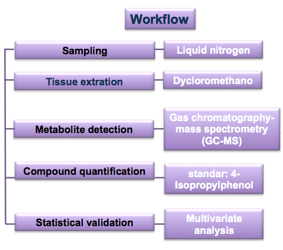
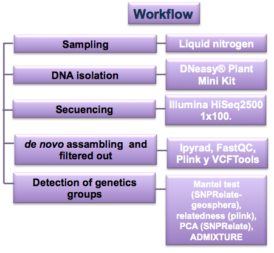
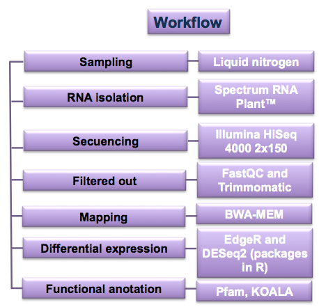

# README Paper Abies vs ozone

This repository contains the scripts, data, metadata, and results to perform the transcriptomic, the genetic, and the metabolic analysis to **"Abies vs Ozone's Project"**.

In these directories you will find some analysis to answer these project's particular aims:

* To quantify the secondary metabolite relative abundance in the tolerant and the damaged trees during two ozone concentration periods. [Metabolomic analysis](https://github.com/VeroIarrachtai/Abies_vs_ozone/tree/master/2_Metabolomics)

* To identify the tolerance sacred fir's origins.  [Genomic analysis](https://github.com/VeroIarrachtai/Abies_vs_ozone/tree/master/3_Genomics)

* To evaluate the tolerant and the damaged trees differential expression in the two ozone concentration periods. [Transcriptomic analysis](https://github.com/VeroIarrachtai/Abies_vs_ozone/tree/master/4_Transcriptomics)


## GENERAL directory structure:

```
+----- Abies_vs_ozone/
|	+--1_Sampling/
|	+--2_Metabolomics/
|	+--3_Genomics/
|	+--4_Transcriptomics/
|	+--5_INFO_PROJECT/
|	+--README.md
```

**README.md**: There is a markdown file about this project. This file includes the repository's disposition.

**1_Sampling**: There is a directory with the coordinates and the samples' disposition in the omics analisys.

**2_Metabolomics**: There are some metabolite-generated analysis with a gas chromatograph spectrum mass (GC-SM). Data from the html files were loaded into the tables. Subsequently, the relative abundance was calculated. Finally, all the samples' values were compared using a barplot, ANOVA, and PCA analysis.

**3_Genomics**: There are some genomic analysis from the GBS sequencing. **ipyRAD** was used to assemble *de novo*, **VCFTools** and **plink** were used to make more specific filters. The relationship was calculated without multiple SNPs in the same loci. The mantel test, PCA, and admixture were performed in order to identify samples' local origin.

**4_Transcriptomics**: There are some transcriptomic analysis from RNAseq data. Samples were cut with **Trimmomatic** and they were mapped to a reference transcriptome with **BWA**. **Rstudio** allowed to evaluate differential expression between the samples with **edgeR** and **DESeq2**. Subsequently, a volcanoplot was performed to show overexpressed and underexpressed genes.

**5_INFO_PROJECT**: There are some slide-shows, summaries, and final analysis.

# Principal analysis workflow:

## [METABOLOMICS](https://github.com/VeroIarrachtai/Abies_vs_ozone/tree/master/2_Metabolomics)

### To quantify the secondary metabolite relative abundance in the healthy and the damaged trees during the two ozone concenrations periods.



Check more information about this pipeline in [README_metabolomics](https://github.com/VeroIarrachtai/Abies_vs_ozone/tree/master/2_Metabolomics/README_metabolomics.md).

To see a short summary about the final metabolomics analysis click [here](https://github.com/VeroIarrachtai/Abies_vs_ozone/blob/master/5_INFO_PROJECT/METABOLOMICS_ligth_analysis.md).

## [GENOMICS](https://github.com/VeroIarrachtai/Abies_vs_ozone/tree/master/3.-Genomics)

### To identify the tolerance sacred fir's origins.



Check more information about this pipeline in [README_genomics](https://github.com/VeroIarrachtai/Abies_vs_ozone/blob/master/3_Genomics/README_genomics.md).

To see a short summary about the final genomic analysis click [here](https://github.com/VeroIarrachtai/Abies_vs_ozone/blob/master/5_INFO_PROJECT/GENOMICS_ligth_analysis.md).

## [TRANSCRIPTOMICS](https://github.com/VeroIarrachtai/Abies_vs_ozone/tree/master/4_Transcriptomics)

### To evaluate the healthy and the damaged trees differential expression in the two ozone's periods.



Check more information about this pipeline in [README_transcriptomics](https://github.com/VeroIarrachtai/Abies_vs_ozone/blob/master/4_Transcriptomics/README_Transcriptomics.md).

To see a short summary about the final transcriptomic analysis click [here](https://github.com/VeroIarrachtai/Abies_vs_ozone/blob/master/5_INFO_PROJECT/TRANSCRIPTOMICS_ligth_analysis.md).

### Contact

```
Verónica Reyes Galindo
veronica.rg.pb@gmail.com
```
