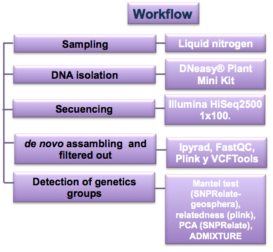

# README Paper Abies vs ozone

This repository contains scripts, data, metadata, and results to perform transcriptomic, genetic, and metabolic analysis to **"Abies vs ozone's project"**.

In these directories you will find some analysis to answer these project's particular aims:

* To evaluate the tolerant and damaged trees differential expression in two ozone concentration periods. [Transcriptomics analysis](https://github.com/VeroIarrachtai/Abies_vs_ozone/tree/master/4.-Transcriptomics)

* To identify tolerance sacred fir's origins.  [Genomics analysis](https://github.com/VeroIarrachtai/Abies_vs_ozone/tree/master/3.-Genomics)

* To quantify the secondary-metabolite relative-abundance in tolerance and damaged trees during two ozone concentration periods. [Metabolomics analysis](https://github.com/VeroIarrachtai/Abies_vs_ozone/tree/master/2.-Metabolomics)

## Principal directories.

There's repository structure:

```
+----- Abies_vs_ozone/
|	+--1.-Sampling/
|	+--2.-Metabolomics/
|	+--3.-Genomics/
|	+--4.-Transcriptomics/
|	+--5.-INFO_PROJECT/
|	+--README.md
```

**README.md**: There's a markdown file about my project. This file includes repository's disposition.

**1.-Sampling**: There's a directory with coordinates and samples' disposition in omics analisys.

**2.-Metabolomics**: There're metabolites analysis generated with gas chromatograph spectrum mass (GC-SM). Data from html files were loaded into tables. Subsequently, relative abundance was calculated. Finally, values between samples were compared from a barplot, ANOVA, and PCA analysis.

**3.-Genomics**: There're genomic analysis from GBS sequencing. **ipyRAD** was used to assemble *de novo*, **VCFTools** and **plink** were used to make more specific filters. Relationship was calculated without multiple SNPs in same loci. Mantel test, PCA, and admixture were performed.

**4.-Transcriptomics**: There're transcriptomic analysis from RNAseq data. Samples were cut with **Trimmomatic** and they mapped to a reference transcriptome with **BWA**. Rstudio allowed to evaluate differential expression between samples with **edgeR** and **DESeq2**. Subsequently, volcanoplot was performed to show overexpressed and underexpressed genes.

**5.-INFO_PROJECT**: There're exhibitions, summaries and final analysis.

# Principal analysis workflow:

## [METABOLOMICS](https://github.com/VeroIarrachtai/Abies_vs_ozone/tree/master/2.-Metabolomics)

### Quantify secundary metabolites relative abundance in healthy and damaged trees during two ozone concenrations periods.


Check more information about this pipeline in [README_metabolomics](https://github.com/VeroIarrachtai/Abies_vs_ozone/tree/master/2.-Metabolomics/README_metabolomics.md).

To see a short summary about final metabolomics analysis you can go [here](https://github.com/VeroIarrachtai/Abies_vs_ozone/blob/master/5.-INFO_PROJECT/METABOLOMICS_ligth_analysis.md).

## [GENOMICS](https://github.com/VeroIarrachtai/Abies_vs_ozone/tree/master/3.-Genomics)

### Identify tolerance sacred fir's origins.



Check more information about this pipeline in [README_genomics](https://github.com/VeroIarrachtai/Abies_vs_ozone/blob/master/3.-Genomics/README_genomics.md).

To see a short summary about final genomics analysis you can go [here](https://github.com/VeroIarrachtai/Abies_vs_ozone/blob/master/5.-INFO_PROJECT/GENOMICS_ligth_analysis.md).

## [TRANSCRIPTOMICS](https://github.com/VeroIarrachtai/Abies_vs_ozone/tree/master/4.-Transcriptomics)

### Evaluate differential expression of healthy and damaged trees in two ozone's periods.


Check more information about this pipeline in [README_transcriptomics](https://github.com/VeroIarrachtai/Abies_vs_ozone/blob/master/4.-Transcriptomics/README_TRANSCRIPTOMICS.md).

To see a short summary about final transcriptomics analysis you can go [here](https://github.com/VeroIarrachtai/Abies_vs_ozone/blob/master/5.-INFO_PROJECT/TRANSCRIPTOMICS_ligth_analysis.md).

### Contact

```
Verónica Reyes Galindo
veronica.rg.pb@gmail.com
```
